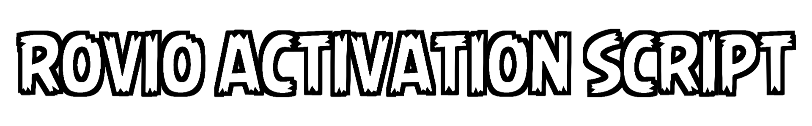

<div align="center">


<br><br>
A collection of scripts that allow you to fully unlock Bad Piggies on your PC.

[](https://www.python.org/downloads/)

⚙️ [How does it work?](#%EF%B8%8F-how-does-it-work) •
🚀 [How to use it?](#-how-to-use-it) •
🐛 [Found a bug?](#-found-a-bug)
</div>

---

### ⚙️ How does it work?

In February 2024, the activation servers for full versions of several Rovio PC games, including Bad Piggies, were permanently shut down. When you attempt to enter an activation code in the game’s activation window, the game still sends a request to the servers. However, due to the lack of response from the servers, the activation process fails.

This is where this script comes into play. The script intercepts requests to `cloud.rovio.com/drm/consumeKey/` URL, simulating a server response. It then forwards this simulated response to the game client. As a result, the game believes that the Rovio servers are operational, and the activation code you input is considered valid. Consequently, the game gets activated, allowing you to enjoy the full experience!

#### Without the script:


#### With the script:


> **Note:** The gifs above demonstrate the **Fiddler Script** method which runs in the background and allows you to activate the game directly through the in-game menu. If you choose the **Python Script** method, it's recommended to run it while the game is closed. The Python script generates the necessary activation file contents and the game will be activated the next time you launch it!

---

### 🚀 How to use it?

<details>
<summary><b>Click to expand the step-by-step activation guide</b></summary>
<br>

#### Option 1: Python Script (Recommended, works for all versions)
This script automatically generates the necessary configuration `Settings.xml` file with the activation data and saves it in the game data folder in AppData. This method works for all Bad Piggies versions on Windows.

1. Download and extract the `RovioActivationScript.py` file to any location on your Windows PC from this repository. [(Direct download link)](https://github.com/PRO100KatYT/RovioActivationScript/archive/refs/heads/main.zip)
2. Make sure you have [Python](https://www.python.org/downloads/) installed (tested on version 3.9 but should work on 3.2 or newer).
3. Close the game if it's open.
4. Run the downloaded script (e.g., by double-clicking it).
5. Once the script is finished with no errors, Bad Piggies should be activated!

<br>

#### Option 2: Fiddler Script (Alternative, works for v1.3.0+)
1. Download and Install [Fiddler Classic](https://www.telerik.com/download/fiddler) and open it.
2. If you get an `AppContainer Configuration` popup, click cancel.
3. Head to the `FiddlerScript` section.
4. If there is an `Introduction` script, remove it.
5. Paste the following script there and click on `Save Script`:

```javascript
import Fiddler;
// Script by PRO100KatYT
 
class Handlers
{
    static function OnBeforeRequest(oSession: Session) {
        if (oSession.fullUrl.Contains("[cloud.rovio.com/drm/consumeKey/](https://cloud.rovio.com/drm/consumeKey/)"))
        {
            oSession.utilCreateResponseAndBypassServer();
            oSession.responseCode = 200;
            oSession.oResponse.headers.HTTPResponseCode = 200;
            oSession.oResponse.headers.HTTPResponseStatus = "200 OK";
            oSession.utilSetResponseBody("status=1&msg=valid");
        }
    }
}
```

6. Go to Bad Piggies, input any code into the activation window, and confirm it.
7. Your Bad Piggies PC copy should be activated. You can now close Fiddler and play the game!

*Note: You can find a version of this script with instructions for Linux (Wine) [here](https://github.com/PRO100KatYT/RovioActivationScript/issues/1) thanks to j-romchain.*

</details>

---

### 🐛 Found a bug?
Feel free to [open an issue](https://github.com/PRO100KatYT/RovioActivationScript/issues/new/choose "Click here if you want to open an issue.") if you encounter any bugs or just have a question.

---

### ⭐ Star History

<details>
<summary><b>Thanks to all stargazers! Click to expand the Star History Chart.</b></summary>
<br>

[](https://www.star-history.com/#PRO100KatYT/RovioActivationScript&type=date&legend=top-left)

</details>
